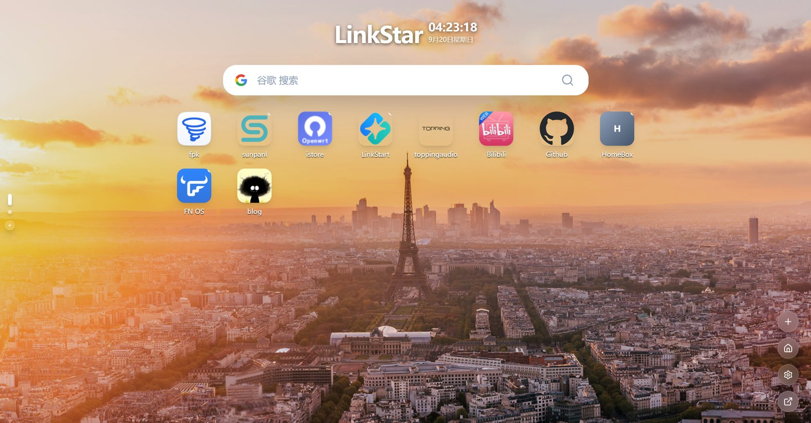

<div align="center">


# LinkStar

**No public IP? Still reach your home services from anywhere. One Go binary, download and run.**

A network entry tool for home servers, NAS, and soft routers — **STUN + UPnP** hole punching, **DDNS** that follows your changing home IP, plus **certificates** and a **reverse proxy** built in, with a navigation homepage on top.

[](https://github.com/ZluxYao/LinkStar/releases/latest)
[](go.mod)
[](#nat-traversal)
[](LICENSE)
[](#building-from-source)
[](#developer-guide)

[简体中文](README.md) · **English**



<sub>Navigation homepage</sub>


<sub>Dashboard · NAT traversal</sub>

</div>

---

Reaching your NAS, soft router, or Jellyfin from outside your home usually gets stuck on three things: your ISP won't give you a public IP, your home IP changes daily, and the browser flags everything as "not secure". LinkStar puts those three problems and everything around them — hole punching, DDNS, certificates, reverse proxy — into one program. The frontend is embedded via Go `embed`, so you download a single binary and run it. It serves two interfaces: a public **Navigation Homepage** and a password-protected **Admin Dashboard**.

## Table of Contents

- [Why LinkStar](#why-linkstar)
- [Features](#features)
- [NAT Traversal](#nat-traversal)
- [Quick Start](#quick-start)
- [User Guide](#user-guide)
  - [Entry Points](#entry-points)
  - [Password & Login](#password--login)
  - [Data Directories](#data-directories)
  - [Certificates](#certificates)
  - [Reverse Proxy](#reverse-proxy)
  - [DDNS](#ddns)
  - [Entry Redirect (Cloudflare)](#entry-redirect-cloudflare)
  - [Webhook Variables](#webhook-variables)
- [Developer Guide](#developer-guide)
- [Roadmap](#roadmap)
- [Notes & Caveats](#notes--caveats)
- [Community & Support](#community--support)
- [License](#license)

## Why LinkStar

- **One binary does it all.** No Docker, no stack of services to install. The frontend ships inside; `./linkstar` just runs.
- **Works without a public IP.** STUN probes your public endpoint, UPnP creates the mapping — services behind carrier-grade NAT still become reachable.
- **Follows address changes on its own.** When the public IP or external port changes, it updates DNS records, rewrites the Cloudflare redirect rule, and fires Webhooks. Nothing to babysit.
- **Certificates and reverse proxy included.** No separate nginx + certbot setup. Certificates are issued and renewed automatically; the reverse proxy does what nginx does.
- **You don't need to know the internal IP to start.** Scan your LAN, see which machines are up and which ports they have open, click one to create the service.
- **Two form factors.** A CLI build for running as a background service, and a system-tray desktop build (Wails).

## Features

| Module | Capabilities |
| --- | --- |
| 🏠 Navigation Homepage | App shortcuts, categories with drag-and-drop ordering, search engine management, Bing daily / custom wallpapers, icon upload and auto-fetch |
| 🌐 NAT Traversal | STUN probing of local / public IP and NAT chain, automatic UPnP port mapping, heartbeat keepalive, live external address |
| 🧭 NAT Type Detection | RFC 5780 probing, UDP and TCP judged separately: open internet, NAT1–NAT4. Check here first when a hole won't open |
| 🔌 Service Management | TCP / UDP services per device, duplicate a service, enable/disable from the card, `/go/{service}` to reach a service by name even after the port moves |
| 📡 LAN Scan | Pick a subnet and scan it: online hosts and their open ports, with names for common ones (DSM, PVE, Alist, Jellyfin…). Click a port to create the service |
| 🔐 Certificates | Upload PEM, read from a local path, ACME DNS-01, ACME HTTP-01, plus self-signed. SNI matching, wildcards, automatic renewal before expiry |
| 🔁 Reverse Proxy | What nginx does: host-based routing, HTTP / HTTPS dual entry, per-site dedicated ports, WebSocket / SSE passthrough, access logs |
| 🌍 DDNS | A / AAAA records, five IP sources, periodic sync to your DNS provider |
| ↪️ Entry Redirect | One fixed domain always points at the service's current external address — no Cloudflare IDs to fill in |
| 🔔 Webhook | HTTP requests on address change, with built-in generic JSON and Cloudflare SRV templates |
| 📋 Runtime Logs | Read logs in the dashboard, filtered by level and keyword |
| ⚡ Live Status | Periodic backend health checks, pushed to the UI over SSE |
| 🔒 Password Protection | Guided setup on first use (minimum 8 characters), JWT-protected admin APIs, desktop window skips login locally |
| 📱 Mobile | Both the dashboard and the homepage work on small screens |

**Supported DNS providers**: Cloudflare, Alibaba Cloud DNS, Tencent Cloud DNSPod, Baidu Cloud, Huawei Cloud, NameCheap, NameSilo.

## NAT Traversal

LinkStar's NAT traversal is built on the standard **STUN** protocol (via [pion/stun](https://github.com/pion/stun)):

1. **STUN probing** — sends Binding requests to public STUN servers to learn the public IP and port behind the NAT, and to determine the NAT type.
2. **Port-reuse hole punching** — reuses the same local port for listening (TCP/UDP), keeping the NAT mapping opened by the STUN session alive.
3. **Automatic UPnP mapping** — when the gateway supports UPnP, creates a port mapping pointing the public port at the internal service (TCP).
4. **Port forwarding** — forwards inbound external connections to the target device's internal port, exposing services without a public IP.
5. **Heartbeat keepalive** — periodic health checks and reconnection; port changes are detected and trigger DDNS / entry redirect / Webhook sync.

You can also terminate TLS right at the hole, so external access is plain `https://` with no browser warning and no extra layer to set up.

> Suited to home broadband behind carrier-grade NAT and soft routers without a dedicated public IP — a lightweight self-hosted alternative to frp / ngrok.

## Quick Start

Download the file for your platform from [Releases](https://github.com/ZluxYao/LinkStar/releases/latest):

| File | Platform |
| --- | --- |
| `linkstar` | Linux x86_64 |
| `linkstar-linux-arm64` | Linux ARM64 (Raspberry Pi 4/5, ARM routers, NAS) |
| `linkstar-linux-armv7` | Linux ARMv7 (older Raspberry Pi, 32-bit ARM routers) |
| `linkstar-linux-mipsle` | Linux MIPS little-endian (OpenWrt routers) |
| `linkstar-cli.exe` | Windows x86_64, command line |
| `linkstar-desktop.exe` | Windows x86_64, desktop build with window and tray |
| `LinkStar-x.y.z-x86.fpk` | fnOS NAS package |

macOS currently needs to be built on a Mac — see [BUILD.md](BUILD.md).

```bash
# Linux
chmod +x linkstar
./linkstar
```

```powershell
# Windows
.\linkstar-cli.exe
```

Then open `http://localhost:3333/`. The first run creates `config/`, `data/`, and `logs/`; the first visit to the dashboard walks you through setting an admin password. Nothing else to configure.

To install it as a service that starts at boot, or to upgrade from an older version, see [Deployment & Upgrade](docs/部署与升级.md) *(Chinese)*. For a first-time walkthrough, see [Getting Started](docs/快速上手.md) *(Chinese)*.

## User Guide

### Entry Points

| Entry | URL | Notes |
| --- | --- | --- |
| Navigation homepage | `http://localhost:3333/` | Public, no login |
| Admin dashboard | `http://localhost:3333/linkstar/` | Password required |
| Service index | `http://localhost:3333/go/{service}` | Redirects to that service's current external address |

> The service listens on `0.0.0.0:3333` (the port is not configurable yet) and is reachable from other devices on the LAN via this machine's IP.

The **service index** deserves a note. The external port from hole punching drifts, and a DNS A record can't carry a port — so normally every service needs its own Cloudflare redirect rule (the free plan caps at 10), with a Webhook rewriting it whenever the port moves.

The alternative: **expose only LinkStar's own hole, and let it look up everything else**, taking Cloudflare from N rules down to 1.

```text
https://linkstar.example.com/fw        (Cloudflare edge, the one redirect rule)
  → https://ls.example.com:21313/fw    (LinkStar's own hole)
  → 307 https://fw.example.com:34521/  (fw's hole, TLS terminated there)
```

Both forms work: the explicit `/go/fw`, or a bare `/fw` when it doesn't collide with an existing path. Service names are case-insensitive; trailing paths and query strings are carried through. 307 rather than 301 is deliberate — a permanent redirect would make the browser memorise a port that is guaranteed to expire, recoverable only by clearing browser data. 307 also preserves method and body. Responses carry `Cache-Control: no-store`.

When the hole isn't up yet, or the service is disabled, you get a page explaining why instead of a redirect that can't possibly work.

### Password & Login

- **First-time setup** — the dashboard walks you through setting an admin password, **minimum 8 characters**. Until it's set, all admin APIs refuse access.
- **Session length** — login issues a JWT, valid 7 days by default; adjust `tokenTtlHours` in `config/authConfig.json`.
- **Changing the password** — under "System Settings", after confirming the old one. **Other devices must log in again afterwards** — changing the password rotates the signing key, so tokens already issued are invalidated immediately.
- **Forgotten password** — stop the program, delete `config/authConfig.json`, start it again to return to the setup flow (all logged-in devices are invalidated).
- **Desktop build** — the local window skips login over an internal channel; browser access still needs the password.

### Data Directories

Configuration lives in plain JSON files under the program's working directory:

| Path | Contents |
| --- | --- |
| `config/homeConfig.json` | Homepage: shortcuts, search, categories, layout, wallpaper |
| `config/stunConfig.json` | STUN server list, devices and services, entry redirect settings |
| `config/ddnsConfig.json` | DNS providers, records, sync interval |
| `config/certConfig.json` | Certificate list and ACME options |
| `config/proxyConfig.json` | Reverse proxy entries and sites |
| `config/webhookConfig.json` | Webhook templates |
| `config/authConfig.json` | Password hash, JWT signing key, token TTL |
| `data/cert/{certID}/` | Certificate and key PEMs, ACME account key |
| `data/icon/` | Uploaded or fetched site icons |
| `data/wallpaper/` | Uploaded wallpapers |
| `logs/YYYY-MM-DD/` | That day's `info.log` and `err.log` |

> `config/` holds DNS provider API tokens, the admin password hash, and certificate private keys. **Back it up, but never commit it to Git or share it.** Mask the tokens in `ddnsConfig.json` before posting screenshots.

### Certificates

Four sources, plus self-signed:

| Source | When to use it | What you need |
| --- | --- | --- |
| Upload PEM | You already have a certificate | The certificate and key text |
| Local path | certbot / acme.sh already renews on this machine | Two file paths; changes are hot-reloaded |
| ACME DNS-01 | You want automatic issuance, wildcards, or port 80 is blocked | Domain on a supported provider, token with DNS edit permission |
| ACME HTTP-01 | Automatic issuance and inbound port 80 works | Domain resolving to this machine, port 80 reachable |
| Self-signed | You only want encryption and don't care about browser trust | Nothing |

**A fresh install ships with a self-signed certificate**, marked as default. That way "terminate TLS at the hole" and "HTTPS on the reverse proxy" work the moment you enable them, instead of failing the handshake because no certificate exists. Browsers will warn about it — that's expected; switch to an ACME certificate for anything public. Delete it and it won't come back on restart.

Two ACME reminders: **certificates from the staging environment are not trusted by browsers** — switch to production once the flow works; and production blocks you after 5 failures in an hour, so don't retry in a loop.

Certificates are matched by SNI, support wildcards, and renew automatically before expiry. Renewal swaps a pointer — **existing connections are not dropped**.

### Reverse Proxy

This is the nginx job: accept on one port, route to different internal services by hostname.

- The **default entry** corresponds to nginx's `listen 80` / `listen 443 ssl`. Sites that don't specify their own port are served here. A fresh install pre-fills 80 / 443 but leaves them **disabled** — no port is bound until you enable it.
- A site can **take a dedicated port**; multiple ports coexist.
- Each site configures its own hostnames (several allowed), path prefix, HTTPS, and certificate.
- `X-Forwarded-For` is added, and `Host` is written back to whatever the client sent — otherwise Jellyfin, Home Assistant, and friends generate redirect URLs pointing at internal IPs.
- SSE is not buffered; WebSocket passes through untouched.
- If the backend scheme is set wrong, it retries once with the other one.
- When a backend is unreachable you get a readable 502 naming the site and the backend, instead of the browser's `ERR_CONNECTION_REFUSED`.
- Access logging can be toggled.

> The "backend is HTTPS" checkbox only describes **the internal hop**: leave it off when the internal service speaks plain HTTP, turn it on when it speaks HTTPS (self-signed counts). Whether the site is HTTPS *externally* is a separate switch with its own certificate.

### DDNS

Five IP sources for a record:

| Source | Where the address comes from |
| --- | --- |
| `stun` | The public IP discovered by the STUN module |
| `web` | A URL that returns your IP; leave blank to use the built-in IPv4 / IPv6 sources |
| `dns` | Resolve another domain and follow it |
| `interface` | Read a local NIC. The UI lists the NICs with their addresses so you don't have to recall the name |
| `custom` | A fixed address you type in; no probing |

Records are scanned every 5 minutes by default. **A record that failed retries after 30 seconds, doubling each consecutive failure, capped at the configured interval** — so "STUN hasn't found the public IP yet" recovers quickly at boot, while "the token is wrong" doesn't turn into hammering the provider's API. The public IP becoming available also triggers an immediate sync rather than waiting for the next round.

Cloudflare supports the `proxied` toggle; NameCheap currently suits IPv4 A records only.

### Entry Redirect (Cloudflare)

**The problem:** the external port from hole punching changes, but a domain can only point at an IP, not a port. So every time the port moves, the address people saved stops working.

**The approach:** a fixed entry hostname (say `nas.example.com`) 307-redirects to the service's current real address. You fill in the entry hostname, the landing hostname, and whether to keep the path — the zone / ruleset / rule IDs are looked up by the backend. The provider is reused from your DDNS config, so the token isn't entered twice.

Sync rides the keepalive heartbeat and doesn't call the provider API when nothing changed. Saving the service also adds a DDNS record for the landing hostname, so it keeps up when the home IP changes.

The two DNS records have **opposite requirements**, and the UI shows their current state side by side:

- **The entry hostname must be proxied (orange cloud)** — otherwise the request never reaches Cloudflare and the redirect rule never runs.
- **The landing hostname must NOT be proxied (grey cloud)** — Cloudflare's proxy won't forward the high-numbered port from hole punching.

Get this backwards and neither side reports an error — it just doesn't work. Check those two lines in the UI.

> Deleting a service also removes the DNS records, Cloudflare rules, and entry placeholder records it created. Three safeguards: records not auto-created by LinkStar are left alone, records you edited yourself are left alone, and records still used by another service are left alone.

### Webhook Variables

Runtime variables are available in the request body and URL:

```json
{
  "service": "#{service_name}",
  "device": "#{device_name}",
  "address": "#{address}",
  "ip": "#{external_ip}",
  "port": #{port},
  "protocol": "#{protocol}",
  "phase": "#{phase}",
  "time": "#{updated_at}"
}
```

Useful for syncing to external systems after a port change, service restart, or address update.

> If all you want is "keep one fixed domain pointing at this service", use [Entry Redirect](#entry-redirect-cloudflare) instead — no Webhook needed.
>
> Duplicating a service leaves its Webhook disabled. A copied URL usually targets one specific record or rule; two holes writing to the same one both report success, but that domain can only reach one of them at any moment.

## Developer Guide

For building from source, contributing, or forking.

### Stack

- **Backend**: Go, Gin, logrus, pion/stun, goupnp, lego (ACME)
- **Desktop shell**: Wails v3 (optional, for the tray build)
- **Frontend**: React, TypeScript, Vite, Tailwind CSS, lucide-react
- **Storage**: local JSON config files

### Requirements

- Go 1.25+
- Node.js 20+ and npm (to build the frontend)

### Building from Source

Build the frontend first (the backend embeds `web/home/dist` and `web/admin/dist`):

```bash
cd web/home && npm install && npm run build
cd ../admin && npm install && npm run build
```

Then build the backend from the repository root:

```bash
cd ../..
go build -o linkstar .     # CLI / service build
./linkstar
```

> After changing frontend code, re-run the corresponding `npm run build` or the embedded assets stay stale.
>
> For more build detail (size trimming, cross-compilation, desktop packaging) see [BUILD.md](BUILD.md).

### Desktop Build (optional)

A [Taskfile](Taskfile.yml) is included for the Wails v3 tray build:

```bash
task build:frontend   # build both Home and Admin frontends
task build            # build the desktop app for the current platform
task run              # run it
```

The desktop build lives in the tray, opens the dashboard or homepage quickly, and minimises to tray on close.

### Local Development

Backend:

```bash
go run .
```

Home / Admin frontends (each in its own directory):

```bash
cd web/home  && npm install && npm run dev
cd web/admin && npm install && npm run dev
```

The frontends call same-origin `/api/...`; configure a Vite dev-server proxy when developing, or test against the embedded static build.

### Project Layout

```text
.
├── api/              # HTTP API handlers
├── core/             # logging, shutdown-save plumbing
├── modules/          # home / stun / ddns / cert / proxy / webhook / auth
├── routers/          # Gin route registration
├── utils/            # shared helpers
├── web/home/         # navigation homepage frontend
├── web/admin/        # admin dashboard frontend
├── app.go            # backend startup, module init, asset embedding
├── main_cli.go       # CLI / service entry point
└── main_desktop.go   # Wails desktop entry point (build tag: desktop)
```

## Roadmap

- [x] Reverse proxy management
- [x] Certificate management
- [ ] Users & permissions
- [ ] Audit logs & notification center
- [ ] Docker image
- [ ] Configurable admin port

## Notes & Caveats

- The service listens on `0.0.0.0:3333` and is directly reachable on the LAN. The navigation homepage is public; admin actions are password-protected.
- UPnP mapping relies on your gateway supporting and enabling UPnP.
- Whether hole punching succeeds depends on your ISP's NAT type. Symmetric NAT (shown in the UI) has a low success rate — that's a protocol-level limit, not a misconfiguration.
- Protect the `config/` directory: it holds DNS provider credentials, certificate private keys, and admin password configuration. Do not commit it to Git or share it.
- **Before exposing a service publicly, check that service's own authentication, access control, and firewall rules.** LinkStar secures its own dashboard; it does not add authentication to the services it tunnels.

## Community & Support

If you run into issues, want to suggest features, or just discuss:

- **QQ Group**: `1053565441`
- **WeChat Group**: scan the QR code below


> If the QR code has expired, add the author on WeChat `ZluxYao` with the note "LinkStar".

## License

Licensed under GPL-3.0-or-later. See [LICENSE](LICENSE).

---

<div align="center">

If LinkStar is useful to you, a ⭐ Star goes a long way.

</div>

<sub>**Keywords**: STUN, NAT traversal, port forwarding, UPnP, DDNS, dynamic DNS, reverse proxy, ACME, Let's Encrypt, certificate management, Webhook, homelab, NAS, homepage dashboard, Go, self-hosted.</sub>
