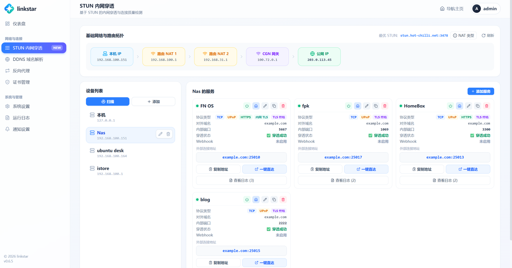

<div align="center">

# LinkStar

**把导航主页、STUN 内网穿透、DDNS 与 Webhook 通知，装进一个 Go 单二进制。**

面向家庭服务器 / NAS / 软路由的网络入口管理工具——基于 **STUN + UPnP** 做 NAT 穿透，无需公网 IP，也能把内网服务稳定地暴露到外网。

[](go.mod)
[](#内网穿透)
[](LICENSE)
[](#从源码构建)
[](#开发者指南)


</div>

---

LinkStar 把几件原本要各自折腾的事——搭一个好看的导航主页、用 STUN 给内网服务打洞、跟着公网 IP 变化更新 DNS、在地址变动时通知外部系统——收进同一个程序里。前端资源通过 Go `embed` 打包，下载一个二进制运行即可，同时提供**首页导航**和**管理后台**两套界面。

> **关键词 / Keywords**：STUN、NAT 穿透 / NAT traversal、内网穿透、端口映射 / port forwarding、UPnP、DDNS、动态域名解析、Webhook、家庭服务器 / homelab、NAS、导航主页 / homepage dashboard、Go、self-hosted。

## 目录

- [为什么用 LinkStar](#为什么用-linkstar)
- [功能特性](#功能特性)
- [内网穿透](#内网穿透)
- [界面预览](#界面预览)
- [快速开始](#快速开始)
- [使用指南](#使用指南)
  - [界面入口](#界面入口)
  - [数据目录](#数据目录)
  - [DDNS 配置说明](#ddns-配置说明)
  - [Webhook 变量](#webhook-变量)
- [开发者指南](#开发者指南)
- [路线图](#路线图)
- [注意事项](#注意事项)
- [License](#license)

## 为什么用 LinkStar

- **一个二进制搞定全部**：不用 Docker、不用装一堆服务，前端已随程序打包，`./linkstar` 直接跑。
- **没有公网 IP 也能穿透**：STUN 探测公网出口 + UPnP 自动映射，家宽 NAT 后的服务也能对外访问。
- **地址一变就自动同步**：公网 IP 变化时自动更新 DDNS 记录、触发 Webhook，无需人工盯着。
- **两种形态**：既能作为后台服务常驻运行（CLI 版），也有系统托盘常驻的桌面版（基于 Wails）。

## 功能特性

| 模块 | 能力 |
| --- | --- |
| 🏠 导航主页 | 应用快捷入口、分类与拖拽排序、搜索引擎管理、Bing 每日壁纸、图标上传与自动抓取 |
| 🌐 内网穿透 | STUN 探测本机 / 公网 IP 与 NAT 路由链路，UPnP 自动创建端口映射，维护外部访问地址 |
| 🔌 服务管理 | 按设备维护 TCP / UDP 服务，配置内部端口、映射端口、HTTPS 标记与是否展示到首页 |
| 🔁 DDNS 解析 | 支持 A / AAAA 记录，定时把公网 IP 同步到 DNS 服务商 |
| 📡 Webhook | 服务地址变化时推送 HTTP 请求，内置通用 JSON、Cloudflare SRV、Cloudflare 重定向规则模板 |
| ⚡ 实时状态 | 后端定时心跳检测链路，Web 界面通过 SSE 实时推送服务状态变化 |

**已适配的 DNS 服务商**：Cloudflare、阿里云 DNS、腾讯云 DNSPod、百度云、华为云、NameCheap、NameSilo。

## 内网穿透

LinkStar 的 NAT 穿透（内网穿透 / NAT traversal）基于标准 **STUN** 协议（[pion/stun](https://github.com/pion/stun) 实现）：

1. **STUN 探测**：向公共 STUN 服务器发送 Binding 请求，拿到本机在 NAT 后的公网出口 IP 与端口，判断 NAT 类型。
2. **端口复用打洞**：在同一本地端口上复用监听（TCP/UDP），保持 STUN 会话打通的 NAT 映射。
3. **UPnP 自动映射**：网关支持 UPnP 时自动创建端口映射，TCP 场景下把公网端口指向内网服务。
4. **端口转发**：把外网入站连接转发到目标设备的内部端口，实现无公网 IP 的服务暴露。
5. **心跳保活**：定时健康检查与重连，公网端口变化时自动感知并触发 DDNS / Webhook 同步。

> 适合家宽（家庭宽带）大内网、运营商 NAT、软路由等没有独立公网 IP 的场景，作为 frp / ngrok 之外的轻量自建选择。

## 界面预览

<table>
<tr>
<td width="50%"><b>导航主页</b><br></td>
<td width="50%"><b>穿透管理</b><br></td>
</tr>
</table>

## 快速开始

拿到编译好的二进制后，直接运行即可：

```bash
# Linux / macOS
./linkstar
```

```powershell
# Windows
.\linkstar.exe
```

启动后打开 `http://localhost:3333/`。首次运行会自动创建 `config/`、`data/`、`logs/` 等目录，无需任何前置配置。

> 想从源码构建，或使用系统托盘桌面版，见 [开发者指南](#开发者指南)。

## 使用指南

### 界面入口

| 入口 | 地址 |
| --- | --- |
| 首页导航 | `http://localhost:3333/` |
| 管理后台 | `http://localhost:3333/linkstar/` |

### 数据目录

LinkStar 使用本地 JSON 文件持久化配置：

| 路径 | 说明 |
| --- | --- |
| `config/homeConfig.json` | 首页导航、搜索、分类、布局、壁纸配置 |
| `config/stunConfig.json` | STUN 服务器列表、设备与服务配置 |
| `config/ddnsConfig.json` | DDNS 服务商、解析记录与同步间隔 |
| `config/webhookConfig.json` | Webhook 模板配置 |
| `data/icon/` | 用户上传或抓取的网站图标 |
| `logs/YYYY-MM-DD/` | 运行日志与错误日志 |

> 这些目录通常包含本机状态或敏感凭据，默认不会提交到 Git。

### DDNS 配置说明

DDNS 记录支持以下 IP 来源：

- `stun`：使用 STUN 模块探测到的公网 IP。
- `web`：从公网 IP 查询接口获取，未填写 URL 时使用内置 IPv4 / IPv6 查询源。
- `dns` / `interface`：类型已预留，当前实现仍在完善中。

Cloudflare 支持 `proxied` 开关；NameCheap 当前仅适合 IPv4 A 记录场景。

### Webhook 变量

Webhook 请求体和 URL 中可使用服务运行时变量，例如：

```json
{
  "service": "#{service_name}",
  "device": "#{device_name}",
  "address": "#{address}",
  "ip": "#{external_ip}",
  "port": #{port},
  "protocol": "#{protocol}",
  "phase": "#{phase}",
  "time": "#{updated_at}"
}
```

适合在端口变化、服务重启或地址更新后同步到外部系统。

## 开发者指南

面向想要从源码构建、参与开发或二次开发的用户。

### 技术栈

- **后端**：Go、Gin、logrus、pion/stun、goupnp
- **桌面壳**：Wails v3（可选，构建托盘桌面版时使用）
- **前端**：React、TypeScript、Vite、Tailwind CSS、lucide-react
- **存储**：本地 JSON 配置文件

### 环境要求

- Go 1.25+
- Node.js 20+ 与 npm（用于构建前端）

### 从源码构建

先构建前端（后端会通过 `embed` 嵌入 `web/home/dist` 与 `web/admin/dist`）：

```bash
cd web/home && npm install && npm run build
cd ../admin && npm install && npm run build
```

再回到项目根目录构建后端：

```bash
cd ../..
go build -o linkstar .     # CLI / 服务版
./linkstar
```

> 修改前端代码后，需重新执行对应前端的 `npm run build`，嵌入的静态资源才会更新。

### 桌面版（可选）

项目内置 [Taskfile](Taskfile.yml)，可通过 `task` 构建基于 Wails v3 的系统托盘桌面版：

```bash
task build:frontend   # 构建前后端前端资源
task build            # 构建当前平台的桌面应用
task run              # 运行桌面应用
```

桌面版在托盘常驻，可快速打开管理后台或导航主页，关闭窗口即最小化到托盘。

### 本地开发

后端：

```bash
go run .
```

Home / Admin 前端（分别在各自目录）：

```bash
cd web/home  && npm install && npm run dev
cd web/admin && npm install && npm run dev
```

前端接口默认请求同源 `/api/...`，联调时可在 Vite 开发服务器中配置代理，或直接使用后端嵌入后的静态页面测试。

### 项目结构

```text
.
├── api/              # HTTP API 处理层
├── core/             # 日志、退出保存等基础能力
├── modules/          # home / stun / ddns / webhook 核心模块
├── routers/          # Gin 路由注册
├── utils/            # 通用工具
├── web/home/         # 首页导航前端
├── web/admin/        # 管理后台前端
├── app.go            # 后端启动、模块初始化、前端资源嵌入
├── main_cli.go       # CLI / 服务版入口
└── main_desktop.go   # Wails 桌面版入口（build tag: desktop）
```

## 路线图

- [ ] 反向代理管理
- [ ] 证书管理
- [ ] 用户与权限
- [ ] 审计日志与通知中心
- [ ] Docker / systemd 部署示例

## 注意事项

- UPnP 映射依赖网关支持并开启 UPnP。
- 请妥善保护 `config/` 中的 DNS 服务商凭据。
- 将服务暴露到公网前，请确认服务本身的认证、访问控制和防火墙策略。

## License

本项目采用 GPL-3.0-or-later 开源许可证，详见 [LICENSE](LICENSE)。

---

<div align="center">

如果 LinkStar 对你有帮助，欢迎点一个 ⭐ Star 支持一下。

</div>
